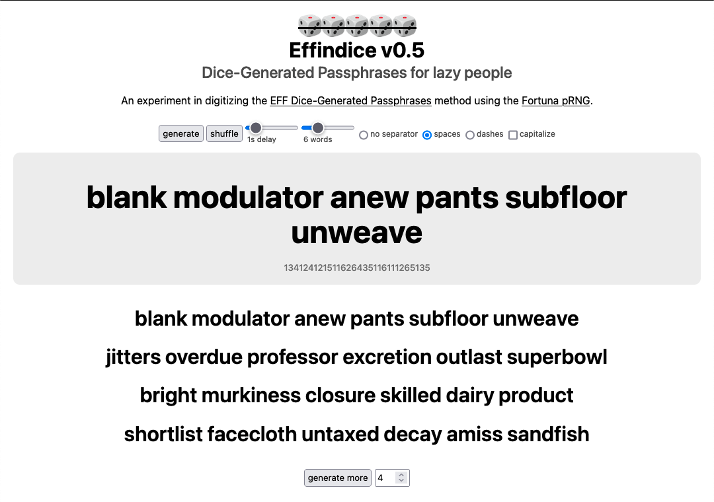

# Effindice 🎲🎲🎲🎲🎲

## EFF Dice Passphrase generator GUI

Effindice is a browser-based passphrase generator implementing the [EFF Dice](https://www.eff.org/dice) method without physical dice. It is a simple javasript GUI application encapsulated within a single HTML file, designed to be used offline. It utilizes the [javascript-fortuna](https://github.com/sethblack/javascript-fortuna) implementation of the [Fortuna pRNG](https://en.wikipedia.org/wiki/Fortuna_(PRNG)) algorithm and incorporates randomized delays to reduce predictability.

The application makes no external calls and should be used locally to generate real passphrases. 

The large filesize is due to the inclusion of [javascript-fortuna](https://github.com/sethblack/javascript-fortuna) 1.0.8 within the document.

[Live demo](https://replete.github.io/effindice/)

[Download the app (index.html)](https://github.com/replete/effindice/raw/main/index.html)

